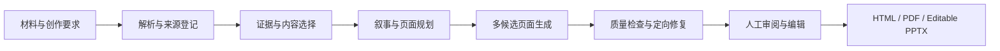

<div align="center">


# 映章 · YingZhang

面向专业内容生产的本地 AI 演示工作台

[](https://github.com/star031104/yingzhang-ai-ppt)
[](https://www.python.org/)
[](https://nodejs.org/)
[](https://react.dev/)
[](https://fastapi.tiangolo.com/)

从 PDF、Word、Excel、PPTX、Markdown、网页和图片中提取结构与证据，完成叙事规划、逐页生成、质量检查，并交付 HTML、PDF 与原生可编辑 PPTX。

[功能概览](#功能概览) · [快速开始](#快速开始) · [部署说明](#部署说明) · [使用指南](#使用指南) · [安全与隐私](#安全与隐私)

</div>

> [!IMPORTANT]
> 当前为首个公开版本 `v0.1.0`，适合本地体验、功能验证和二次开发。重要演示在正式交付前，仍应人工核对事实、版权、排版和 Office 兼容性。

## 项目定位

映章不是一次性生成几张文字卡片的模板工具。它把演示生产拆成材料解析、证据绑定、叙事规划、页面契约、视觉候选、人工选择、定向修复和交付检查等可追踪阶段。

核心设计原则：

- **证据优先**：数字、结论、表格、原文图片与来源位置建立关联。
- **过程可控**：长任务按有界节点执行，可重试、可恢复、可审阅。
- **编辑友好**：图表、表格、时间线、流程图等优先输出为原生 PPT 对象。
- **本地优先**：项目文件、模型凭据和个性化数据默认保存在当前设备。
- **质量门禁**：生成、修复和正式导出共享同一套完整性与可读性检查。

## 功能概览

### 材料理解与证据组织

- 解析 PDF、DOCX、XLSX、CSV、PPTX、Markdown、HTML 和常见图片格式。
- 保留章节层级、表格行列、单位、图像和来源定位。
- 提取关键事实、数字声明、限制条件与可用视觉素材。
- 展示材料读取情况，提示扫描文档、缺失计算值或截断内容等风险。

### 演示规划与页面生成

- 根据受众、目标、时长、语气、品牌和演示类型规划叙事。
- 为每页建立角色、主张、证据、布局区域、文字预算和对象上限。
- 支持多种视觉设计技能，并为页面生成、评估多个候选方案。
- 支持页级并发、任务恢复、单页重生成和对象级修改。

### 专业交付

- 输出网页预览、PDF 和可编辑 PPTX。
- 支持图表、数据表、时间线、流程、层级与关系图等原生对象。
- 提供内容完整性、视觉质量、无障碍与素材许可检查。
- 支持页面版本、人工选择保护、审阅意见和发布快照。

### 本地个人助手

- 可按不同场景保存叙事与视觉偏好。
- 可从参考稿和用户确认过的修改中形成经验建议。
- 支持暂停学习、导入导出、单条遗忘、按场景清除和恢复空白工作区。
- 首次启动不会包含任何作者个人偏好；每个克隆实例从独立的本地数据开始。

## 系统架构



| 层级 | 主要技术 |
| --- | --- |
| Web 工作台 | React 19、TypeScript、Vite、TanStack Query、Zustand |
| API 与任务 | FastAPI、Uvicorn、Pydantic、SQLAlchemy、Alembic |
| 演示渲染 | Playwright、PptxGenJS、python-pptx |
| 文档解析 | PyMuPDF、python-docx、openpyxl、BeautifulSoup |
| 本地存储 | SQLite、系统密钥环、加密文件回退 |
| 模型接入 | OpenAI-Compatible HTTP API |

## 快速开始

### 环境要求

- Git
- Python 3.11 或更高版本
- Node.js 20 或更高版本（包含 npm）
- Windows 10/11 可使用一键启动；macOS 与 Linux 使用手动方式
- 至少一个兼容 OpenAI API 的模型服务；可以是云端 API，也可以是本机服务

### Windows 一键运行

```powershell
git clone https://github.com/star031104/yingzhang-ai-ppt.git
cd yingzhang-ai-ppt
Copy-Item .env.example .env
./启动项目.cmd
```

启动脚本会检查运行环境、安装缺失依赖、构建前端、启动本地服务，并打开 `http://127.0.0.1:8000`。首次安装依赖需要网络。关闭浏览器不会停止后台服务；运行日志位于 `runtime/launcher/`。

如果 8000 端口已被占用：

```powershell
powershell -NoProfile -ExecutionPolicy Bypass -File scripts/start-local.ps1 -Port 8001
```

### 手动安装与运行

以下方式适合开发、排错，或在 macOS/Linux 上部署。

```bash
git clone https://github.com/star031104/yingzhang-ai-ppt.git
cd yingzhang-ai-ppt
python -m venv .venv
```

激活虚拟环境：

```powershell
# Windows PowerShell
./.venv/Scripts/Activate.ps1
```

```bash
# macOS / Linux
source .venv/bin/activate
```

安装依赖：

```bash
python -m pip install --upgrade pip
python -m pip install -e ".[dev]"
npm ci
npx playwright install chromium
```

创建本地配置：

```powershell
# Windows
Copy-Item .env.example .env
```

```bash
# macOS / Linux
cp .env.example .env
```

构建网页并启动完整应用：

```bash
npm run build
python -m uvicorn app.main:app --app-dir apps/api --host 127.0.0.1 --port 8000
```

打开：

- 应用：`http://127.0.0.1:8000`
- API 文档：`http://127.0.0.1:8000/docs`
- 健康检查：`http://127.0.0.1:8000/api/v1/health`

## 部署说明

### 本地生产式运行

推荐先构建前端，再只运行一个 FastAPI 进程。后端会直接提供 `apps/web/dist/` 中的静态页面：

```bash
npm ci
npm run build
python -m pip install -e .
python -m uvicorn app.main:app --app-dir apps/api --host 127.0.0.1 --port 8000
```

默认监听 `127.0.0.1`，仅当前电脑可访问。若要提供局域网或公网访问，需要自行配置反向代理、HTTPS、访问控制和防火墙，并在公开前完整审阅安全设置。首版不建议直接裸露 Uvicorn 端口。

### 前后端开发模式

打开两个终端。终端一运行 API：

```bash
python -m uvicorn app.main:app --app-dir apps/api --reload --port 8000
```

终端二运行 Vite：

```bash
npm run dev
```

访问 `http://127.0.0.1:5173`。开发服务器会把 `/api` 请求代理到 `http://127.0.0.1:8000`。

### 配置项

复制 `.env.example` 后按需修改。常用设置如下：

| 环境变量 | 默认值 | 说明 |
| --- | --- | --- |
| `SLIDEFORGE_DATABASE_URL` | `sqlite:///./runtime/data/yingzhang.db` | 本地数据库地址 |
| `SLIDEFORGE_ARTIFACT_ROOT` | `./runtime/artifacts` | 上传材料和生成产物目录 |
| `SLIDEFORGE_CORS_ORIGINS` | 本地 5173 地址 | 开发环境允许的前端来源 |
| `SLIDEFORGE_RENDER_CONCURRENCY` | `2` | 同时渲染的页面数，低内存设备建议设为 1 |
| `SLIDEFORGE_OPTIONAL_IMAGE_WAIT_SECONDS` | `45` | 可选远程配图的单轮等待时间 |
| `SLIDEFORGE_LOCAL_ONLY_MODE` | `false` | 设为 `true` 后仅允许连接本机模型服务 |
| `SLIDEFORGE_PRIVATE_ACCOUNTS_MODE` | `false` | 本地单用户场景保持关闭 |
| `SLIDEFORGE_OFFICE_EXECUTABLE` | 自动发现 | 可选的 LibreOffice 可执行文件路径 |

不要把真实密钥写入 `.env.example`。模型地址、API Key 和模型选择应在应用的“模型配置”页面中填写，凭据保存在当前设备。

## 使用指南

1. 打开“新建演示”，填写主题、受众、沟通目标、时长和风格要求。
2. 上传材料并检查读取结果，确认关键章节、数字、图表和限制条件。
3. 配置兼容 OpenAI API 的服务地址、API Key 与模型，先执行连接测试。
4. 生成并审阅大纲，确认页面顺序和每页的核心任务。
5. 生成页面候选，在编辑工作台选择版式并进行局部修改。
6. 运行质量检查，处理内容缺失、溢出、对比度、来源或许可问题。
7. 在 PowerPoint、WPS 或 LibreOffice 中复核最终文件，然后正式交付。

### 模型兼容性

模型服务需要提供 OpenAI-Compatible 接口。不同服务对模型列表、视觉输入、结构化输出和超时策略的支持并不完全相同。连接测试成功后，再用少量页面验证能力和成本。图片模型是可选项；未配置时，系统仍可使用材料原图、图表和内置视觉结构完成演示。

### Office 兼容性

PPTX 以原生可编辑为目标，但不同版本的 PowerPoint、WPS 和 LibreOffice 对字体、SVG、动画和文本度量存在差异。正式使用前请在目标 Office 环境中检查字体替换、换行、图表和媒体对象。

## 测试与质量检查

```bash
# Python API、工作流与文档解析
python -m pytest

# 前端组件
npm run test:web

# 演示生成引擎
npm run test:engine

# 前端生产构建
npm run build
```

项目还包含 `benchmarks/` 与 `test-materials/`，用于验证数据页、长文本、学术答辩和业务汇报等典型场景。测试材料只用于功能验证，不代表真实业务结论。

## 数据、安全与隐私

- `.env`、`runtime/`、`output/`、数据库、日志、个人经验、模型凭据和临时文件均不进入版本控制。
- 所有克隆实例从空白本地工作区开始，不包含维护者的账号、API Key、项目数据或个人偏好。
- Provider 凭据优先保存到操作系统密钥环；无法使用时才回退到本地加密文件。
- `SLIDEFORGE_LOCAL_ONLY_MODE=true` 可限制模型与素材请求只访问本机地址。
- 上传含敏感内容的材料前，请确认所连接模型服务的数据处理与保留政策。
- 本地运行不等于已经满足组织级安全要求；公网部署前必须补充身份认证、HTTPS、密钥管理、备份和审计策略。

如怀疑密钥曾被提交，请立即在服务商后台撤销并重新生成；仅从文件中删除并不能使旧密钥失效。

## 项目结构

```text
yingzhang-ai-ppt/
├─ apps/
│  ├─ api/                         FastAPI、工作流、解析与持久化
│  └─ web/                         React 创作工作台
├─ packages/
│  ├─ presentation-engine/         HTML、PDF 与 PPTX 生成引擎
│  ├─ scene-schema/                页面场景中间表示
│  └─ skill-schema/                视觉技能约束
├─ skills/visual/                  内置视觉设计技能
├─ benchmarks/                     渲染质量基准
├─ test-materials/                 可公开的验收材料
├─ tests/                          Python 自动化测试
├─ docs/adr/                       架构决策记录
├─ scripts/                        启动、验证与维护脚本
├─ .env.example                    安全的配置模板
└─ 启动项目.cmd                    Windows 一键启动入口
```

## 常见问题

**页面可以打开，但生成任务失败**

先在“模型配置”中测试连接，确认 Base URL、API Key、模型名和服务额度。再检查启动终端或 `runtime/launcher/` 中的日志。

**Chromium 或页面渲染不可用**

```bash
npx playwright install chromium
```

Linux 环境若缺少系统依赖，可根据 Playwright 的提示安装依赖后重试。

**端口 8000 被占用**

将启动参数改为其他端口，例如 `8001`；使用开发模式时，也要同步调整前端代理配置。

**如何清除本机数据**

优先使用应用内的清除与遗忘功能。需要恢复完全空白的本地工作区时，请先退出服务并备份必要产物，再运行维护脚本 `scripts/reset-personal-workspace.py`。

## 当前边界

- 扫描版 PDF 尚不能保证完成可靠的文字识别。
- 复杂公式、特殊图表、第三方字体和既有 PPT 动画可能需要人工修复。
- 自动生成内容可能包含事实错误；来源绑定不能替代人工核验。
- 网络图片的版权、商标和人物授权仍由使用者最终确认。
- 首个公开版本的接口和数据结构仍可能调整，不承诺向后兼容。

## 参与开发

提交改动前，请至少运行与改动范围相关的测试，并避免提交任何真实材料、账户数据、API Key、运行数据库或生成结果。架构层面的重要变更应在 `docs/adr/` 中补充决策记录。

## 许可证

当前仓库尚未附带开源许可证。除非版权所有者另行授权，否则请勿假定代码可以复制、修改或再分发。
